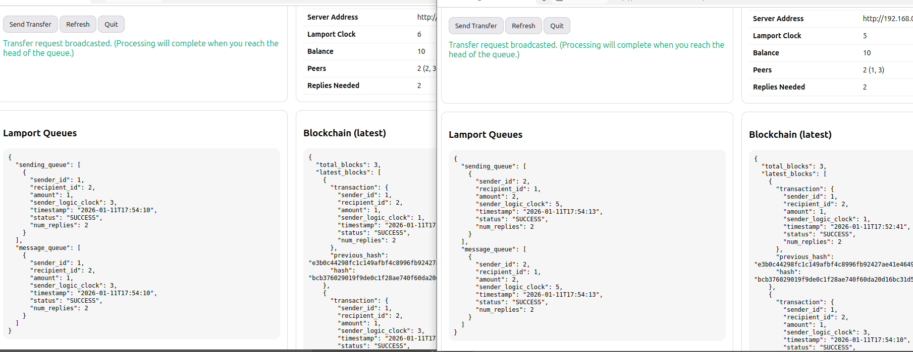

# CSE707 Project: 
## Lamport Ledger (Blockchain-based Lamport Logical Clocks)

---

## Overview

This project demonstrates a distributed system where multiple client nodes coordinate using **Lamport Logical Clocks** to achieve a **totally ordered** view of transfer events. Each transfer request is recorded in a **blockchain-like ledger** (hash-chained blocks) ordered by:

> **Total order key:** `(Lamport timestamp, sender_id)`

We also enforce **Lamport mutual exclusion** for the **transfer critical section**, ensuring that even if multiple clients initiate transfers concurrently, transfers execute **one at a time** in a globally consistent order.

---

## Key Features

- ✅ Distributed deployment: multiple clients on different PCs/VMs  
- ✅ Lamport logical clock update rules:
  - **Send:** `clock = clock + 1`
  - **Receive:** `clock = max(clock, received) + 1`
- ✅ Total ordering of requests: `(timestamp, sender_id)`
- ✅ Lamport mutual exclusion for transfer execution
- ✅ Blockchain-like ledger:
  - Each block includes `transaction + previous_hash`
  - Reordering triggers hash recomputation to maintain chain integrity
- ✅ Web UI for each client: `/ui`

---

## System Architecture

### Components
1. **Lamport Ledger Server (`server.py`)**
   - Maintains account balances
   - Handles client registration
   - Executes transfers (balance updates)

2. **Clients (`client.py`)**
   - Each client is both:
     - a **node** that initiates transfers
     - a **server** that receives peer requests via HTTP endpoints
   - Peer-to-peer message passing for coordination:
     - `/transfer-request`
     - `/transfer-finish`
   - Maintains:
     - Lamport clock
     - Request queues
     - Blockchain ledger replica

### Why this is “Distributed”
The **coordination** (ordering + mutual exclusion) is done by **clients communicating with each other**, not by the Lamport Ledger server.  
The server only holds balances; it does **not** decide who enters the critical section.

---

## Repository Structure

```
src/
  client.py          # Client node + FastAPI endpoints + Web UI
  server.py          # Lamport Ledger server + registration
  blockchain.py      # Transaction/Block/Blockchain data structures
  utils.py           # helper functions
  config.json        # network configuration

requirements.txt
README.md
```

---

## Requirements

- Python 3.9+ (recommended)
- pip
- Tested on:
  - Windows (client)
  - Ubuntu (VM clients)
  - macOS (server)

Install dependencies:
```bash
pip install -r requirements.txt
```

---

## Configuration (`src/config.json`)

Update this file on **every machine** (server + clients):

```json
{
  "SERVER_IPv4": "192.168.0.115",
  "SERVER_PORT": 8000,

  "CLIENT_BIND_HOST": "0.0.0.0",
  "CLIENT_PUBLIC_IPv4": "auto",
  "CLIENT_BASE_PORT": 9000
}
```

### Notes
- `SERVER_IPv4`: LAN/VPN IP of the machine running `server.py`
- `CLIENT_BIND_HOST`: keep as `"0.0.0.0"` so other machines can reach the client
- `CLIENT_PUBLIC_IPv4`:
  - `"auto"` uses automatic IP detection
  - If it detects the wrong IP, set it manually, e.g. `"192.168.0.131"`
- `CLIENT_BASE_PORT`: clients listen on `CLIENT_BASE_PORT + client_id`  
  Example: base 9000 ⇒ client 1 = 9001, client 2 = 9002, client 3 = 9003

---

## How to Run (Local LAN / Same Network)

### Step 1 — Start the Lamport Ledger Server (on server machine)
```bash
python src/server.py
```

(Optional) Check server:
- Open: `http://<SERVER_IP>:8000/`

### Step 2 — Start Clients (on multiple machines/VMs)
On each client machine:
```bash
python src/client.py
```

Each client will:
- register to server
- receive a unique client ID
- start its own FastAPI server

### Step 3 — Open Web UI
For each client:
- `http://<client-ip>:<client-port>/ui`

Example:
- Client 1: `http://192.168.0.131:9001/ui`
- Client 2: `http://192.168.0.154:9002/ui`
- Client 3: `http://192.168.0.153:9003/ui`

---

## How to Run (Different Places / Different Networks)

If clients are not on the same LAN, use a VPN overlay such as **Tailscale** / **ZeroTier**:

1. Install VPN on server + all client machines
2. Use VPN IPs (e.g., `100.x.x.x`) in `config.json`:
   - `SERVER_IPv4 = server VPN IP`
   - `CLIENT_PUBLIC_IPv4 = client VPN IP` (manual recommended)
3. Run server + clients normally

---

## Web UI

Each client exposes a Web UI at:
- `/ui`

It displays:
- Client ID, public address, server address
- Lamport clock
- Balance
- Peer list, replies needed
- Lamport queues (sending queue + message queue)
- Blockchain (latest blocks)

The UI supports:
- Send Transfer (recipient ID + amount)
- Refresh
- Quit (best-effort shutdown)

---

## Experiments & Results

### Experiment 1 — Single Transfer Correctness
**Goal:** Verify a basic transfer updates balances and appends to the blockchain.

**Procedure:**
1. Open Client 1 UI and Client 2 UI
2. Initiate transfer: `Client 1 -> Client 2` (amount = 1 or 5)
3. Refresh both UIs
4. Observe:
   - Client 1 balance decreases
   - Client 2 balance increases
   - Blockchain `total_blocks` increases
   - Block contains previous hash linkage

### Experiment 2 — Concurrent Transfers (Mutual Exclusion)
**Goal:** Verify concurrent transfers execute sequentially (critical section safety).

**Procedure:**
1. On Client 1: prepare transfer `1 -> 2`
2. On Client 3: prepare transfer `3 -> 2`
3. Click “Send Transfer” on both almost simultaneously
4. Refresh all UIs and observe:
   - Requests are totally ordered by `(timestamp, sender_id)`
   - Only one transfer completes first; the second completes after finish/release
   - Blockchain ordering is consistent across clients

---

## Screenshots

```
screenshots/
```

### Distributed Deployment (3 Clients)
<table>
  <tr>
    <td><b>Client 1</b><br></td>
    <td><b>Client 2</b><br></td>
    <td><b>Client 3</b><br></td>
  </tr>
</table>

### Experiment 1 — Single Transfer
**Step A — Request Broadcast**


**Step B — Balances Updated + Block Added**


### Experiment 2 — Concurrent Transfers



---

## Demo Video

- **Video Link:** *(YouTube link)*

---

## Troubleshooting

### “WinError 10048: port already in use”
- A previous client is still running on that port.
- Fix: stop the old process or change `CLIENT_BASE_PORT`.

### Clients not reachable from other machines
- Ensure clients bind to `0.0.0.0`
- Allow firewall ports:
  - server: 8000
  - clients: 9001, 9002, 9003, ...

### Wrong client IP advertised
- Set `CLIENT_PUBLIC_IPv4` manually in `config.json` on that machine.

---

## Future Improvements

- Persistence (store blockchain and balances on disk)
- Replace HTTP with WebSockets / message broker
- Add fault tolerance and retry logic
- Add consensus (e.g., Raft) for server replication